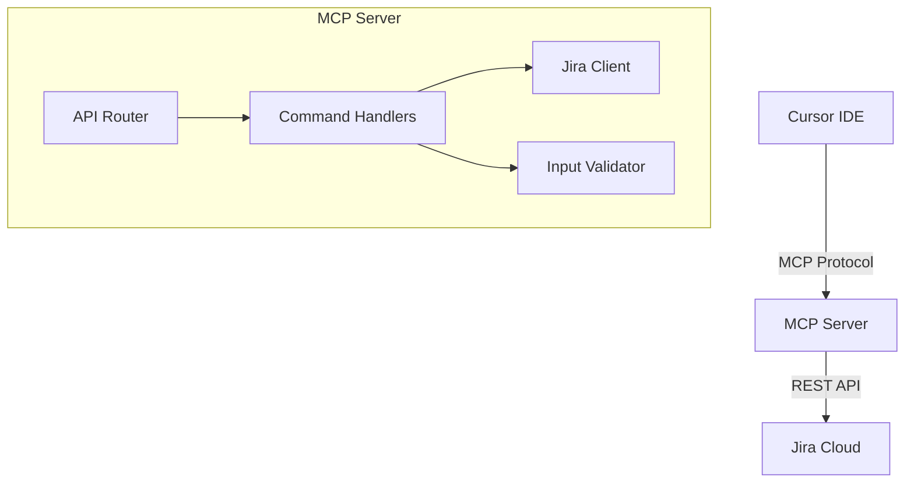

# System Patterns

## Architecture Overview



## Core Components

1. **API Router**
   - Handles MCP protocol communication
   - Routes commands to appropriate handlers
   - Manages response formatting

2. **Command Handlers**
   - Processes MCP commands
   - Validates input parameters
   - Constructs JQL queries
   - Formats responses

3. **Jira Client**
   - Manages Jira API communication
   - Handles authentication
   - Implements rate limiting
   - Error handling

4. **Input Validator**
   - Validates command parameters
   - Sanitizes search queries
   - Validates project keys
   - Ensures JQL safety

## Design Patterns

1. **Command Pattern**
   - Each Jira operation is encapsulated in a command
   - Standardized execution flow
   - Consistent error handling

2. **Factory Pattern**
   - Command handlers are created via factories
   - Ensures proper initialization
   - Manages dependencies

3. **Strategy Pattern**
   - Different integration methods (command vs HTTP)
   - Pluggable authentication strategies
   - Flexible response formatting

## Critical Implementation Paths

1. **Command Processing**
   ```
   Command Input -> Validation -> Handler -> Jira API -> Response Formatting
   ```

2. **Search Implementation**
   ```
   Search Query -> Parameter Validation -> JQL Construction -> Jira Search -> Result Formatting
   ```

3. **Error Handling**
   ```
   Error Detection -> Error Classification -> User-Friendly Message -> Response Formatting
   ``` 